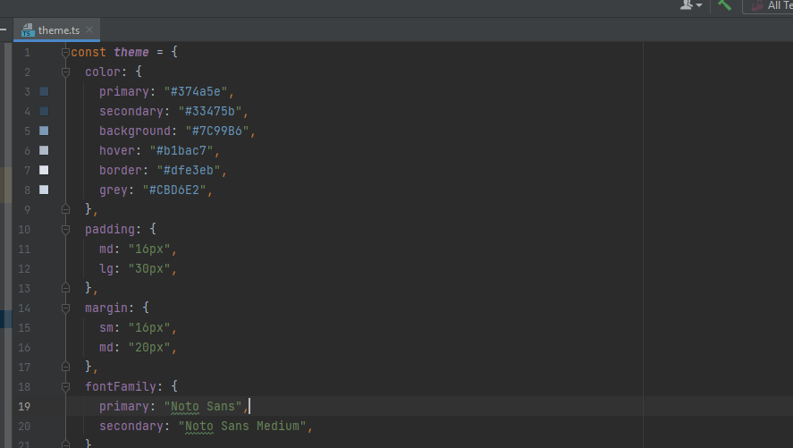

# Integration tool
This is a [React](https://reactjs.org) + [TypeScript](https://www.typescriptlang.org/) project built with [Vite](https://vitejs.dev).

## What's inside?
- [ReactJS](https://reactjs.org)
- [Vite](https://vitejs.dev)
- [TypeScript](https://www.typescriptlang.org)
- [Jest](https://jestjs.io)
- [Testing Library](https://testing-library.com)
- [StoryBook](https://storybook.js.org/)
- [ESLint](https://eslint.org)
- [Prettier](https://prettier.io)
- [Polyfills](https://github.com/vitejs/vite/tree/main/packages/plugin-legacy#readme)

## Preview


# About

Integration tool is a project that aims to integrate/synchronize data in an easy and automatic way so you can have the same data spread and updated on different platforms avoiding manual efforts and e saving time!

This is the first version of the project in which we are just providing integration between Gmail and the Mailchimp platform where the user can have the same list of contacts on both just with one simple click.

Check it out in this preview:

# Background

This document aims to contextualize, bring visibility and help developers and stakeholders to understand the project and its technical aspects. In a clear, direct, and simple way. It will explain how and why it was developed this way and how to continue improving and creating new features following the same pattern.

# Technical Approaches

Thinking about the future and growth of the project, the chosen approaches were taken aiming to have scalability, code quality, cohesion, and coupling and a well defined guideline to be followed by developers. Some teams call it their coding guidelines, coding standards, or coding conventions. 

While each has its own meaning in programming, they often refer to the same thing.

### Technologies

In this application we are using **TypeScript** as the main programming language, so most of the standards will be based on this language following the **React JS** framework, and to build the application with the high performance we are using **Vite**.  

**React JS framework** 

React is a library for building composable user interfaces. It encourages the creation of reusable UI components, which present data that changes over time. React abstracts away the DOM from you uses virtual DOM which is a JavaScript object, offering a simpler programming model and better performance since JavaScript virtual DOM is faster than the regular DOM. React can also render on the server using Node. React implements one-way reactive data flow, which reduces the boilerplate and is easier to reason about than traditional data binding.


**TypeScript**

[TypeScript](https://www.typescriptlang.org/) is a language for application-scale JavaScript. TypeScript adds optional types to JavaScript that support tools for large-scale JavaScript applications for any browser, for any host, on any OS. TypeScript compiles to readable, standards-based JavaScript. 

With TypeScript, it’s easy to define Prop types, making the code much easier to read, and using static Type checking helps to identify errors earlier. The risk of appearing Undefined errors at runtime is less since the TypeScript compiler also detects them at transpile time. With Type Definitions, the codebase will be much more readable and maintainable. Bringing to the project better readability and maintainability.

**Vite** 

**[Vite](https://vitejs.dev/)** is a new generation JavaScript build a tool that aims to improve the developer experience when it comes to building JavaScript applications.  The availability of ES Modules in the browser allows you to run a JavaScript application on the browser without having to bundle them together and the core idea of Vite is simple: transform and serve a piece of your application code using ES Modules when the browser requests for it.

This is essentially letting the browser take over part of the job of a bundler: Vite only needs to transform and serve source code on demand, as the browser requests it. Code behind conditional dynamic imports is only processed if actually used on the current screen.

### Structure and organization

If we rely on the [official documentation](https://reactjs.org/docs/faq-structure.html), **React does not define a correct way to organize our files** and leaves it to the discretion of the developer but there are some common popular approaches followed by the community.

This project presents a modular architecture specified by functionalities for better coupling and distribution of functionalities. Each module represents functionality that in principle is capable of working independently and being initialized from any other module.


Example of modular organization and architecture.

```
|- assets/ ___________ # Assets that might be used for all modules
|- common/ ___________ # All common and reusable components / styles
|- features/ ___________ # All new features must be here using a modular architecture
     |- job-history/ ____# Title of the functionality referring to the context
        |- actions/ ____ # All the actions that will be used in the module
        |- assets/ _____ # Contains all the assets that belong only to that module
        |- components/ __ # Contains all the components that belong only to that module
        |- model/ _______ # Contains all the models that belong only to that module.        
        |- repository/ __ # Contains all API calls
        |- views/  _______# Contains views for the module but can be used outside
        |- index.tsx  _________________ # Module entry point or main screen 
|- App.tsx / ___________ # Entry point
```

### Styling

It is always complex to define how to style your project we have some options like
Styled Components, CSS modules, Pure CSS, or even a custom Sass setup, but based on some research we choose Styled Components because is one of the best options for keeping the styles modular.

[Styled-components](http://styled-components.com/) is a CSS-in-JS styling framework that uses tagged template literals in JavaScript and the power of CSS to provide a platform that allows you to write actual CSS to style React components.

Styled components are easy-to-make React components that you write with the [styled-components](http://styled-components.com/) library, where you can style your components with plain CSS inside your JavaScript code. With this framework, we have some advantages like the freedom to build custom components with CSS.

### Code quality and formatting

Linting and pretty-printing JavaScript code help developers catch errors early, make code more legible, and improve overall code quality, this is the reason we adopted Eslint and Prettier in this project.

**ESlint**

[Linting](https://en.wikipedia.org/wiki/Lint_(software)) is a type of static analysis that finds problematic patterns and code that doesn’t adhere to certain style guidelines. ESLint enables developers to discover problems with their code without actually executing their code.

**Prettier**

Prettier is a code formatter for JavaScript and other popular languages. Prettier enforces a consistent format by parsing code and reprinting it with its own rules that take the maximum line length into account, wrapping code when necessary, this rewriting process prevents developers from introducing any formatting mistakes.

### Testing

**Unit testing** ensures that all code meets quality standards before it’s deployed. This ensures a reliable engineering environment where quality is paramount. Over the course of the product development life cycle, unit testing saves time and money and helps developers write better code, more efficiently. So we can create and execute unit tests we are using **Jest**.


 

*[**Jest**](https://jestjs.io/)* is a JavaScript testing framework designed to ensure correctness of any JavaScript codebase.

### Documentation and showcase

**Storybook** is a user interface development environment and playground for UI components.

The tool enables developers to create components independently and showcase components interactively in an isolated development environment. **Storybook** runs outside of the main app so users can develop UI components in isolation without worrying about app specific dependencies and requirements.

Within **Storybook**, you create what are called “stories”, which are essentially just mini examples or demos. For example, if you were developing a button component, you could create a story for that.


Using Storybook, it’s really easy to show other developers what you’ve created for them: buttons, cards, modals, menus, tooltips, etc.

### Continuous Deploy and Continuous Integration

CI/CD allows organizations to ship software quickly and efficiently. CI/CD facilitates an effective process for getting products to market faster than ever before, continuously delivering code into production, and ensuring an ongoing flow of new features and bug fixes via the most efficient delivery method. It allows you to continuously integrate code into a single shared and easy to access repository and to take the code stored in the repository and continuously deliver it to production. In this project, we adopted **CircleCI** to handle our pipeline and, in the end, deploy it to **Heroku**

# Technical Design

A programming style guide is an opinionated guide of programming conventions, style, and best practices for a team or project.

## **Naming convention**

**General**

- API and function names are typically all in English. Only the display text for blocks is translated.
- Avoid single-letter names. Be descriptive with your naming.
- Names are “contracted” meaning the individual words in a name are adjacent rather than being separated by a _ or other non-alphanumeric character. > Form names as myName and not like my_Name.

`Examples: myFunction(), myMethod(), myField`

### **Class, function, Interfaces, Types, folder, file**

**Class, functions**

- Use PascalCase for class names. `Ex: Name, TheName`
- Use camelCase for variable and function names
- Namespaces, function, function parameters, methods, fields are camel cased. Single word names are all lowercase. `Ex: aaaBbbCcc`

If your file exports a single class, your filename should be exactly the name of the class. Ex: import CheckBox from './CheckBox';

**Interfaces, Types** (same conventions as Class)

- Don't prefix with I

`Ex: interface Foo { }`

- Use type when you might need a union or intersection: `type Foo = number | { someProperty: number }`
- Use interface when you want to extend or implement e.g.

```
interface Foo {
  foo: string;
}
interface FooBar extends Foo {
  bar: string;
}
class X implements FooBar {
  foo: string;
  bar: string;
}

```

**Folder, file**

- All project folders must be written in lowercase.
- All project files must be written in lowercase except files that return visual components

`import CheckBox from './CheckBox';`

- kebab-case can be used to name compound files

`module-name-view`

## Project **structure**

You can see below how the project is organized and where you can put new files or features.

```
|- __mocks__/ ____________ # All mocks used for unit tests file written in jest
|- __cypress__/ __________ # Configuration folder for the Cypress framework 
|- __dist__/ _____________ # Build files to be deployed 
|- src/ 
	|- assets/ _____________ # Assets that might be used for all modules
    |- fonts/
    |- icons/
	|- common/ _____________ # All common and reusable components / styles
	  |- style/ ____________ #
    |- style/ 
    |- ...
	|- features/ ___________ # All new features must be here using a modular architecture
	     |- gmail/ __________# Gmail provider feature
	        |- actions/ ____ # 
	        |- components/ _ #
	        |- model/ ______ #        
	        |- repository/ _ #
	        |- views/  ______# Contains all Gmail related views 
						|- contacts/  ______# Gmail contacts feature related
							|- index.tsx/  ____# List of gmail contacts
						|- index.ts/  _______# Exporting all views that can be used outside
	        |- index.tsx  ________ # Module entry point or main screen 
	     |- mailchimp/ __________# MailChimp provider feature
	        |- actions/ ____ # 
	        |- components/ _ #
	        |- model/ ______ #        
	        |- repository/ _ #
	        |- views/  ______# Contains all Gmail related views 
						|- contacts/  ______# Gmail contacts feature related
							|- index.tsx/  ____# List of Gmail contacts
						|- index.ts/  ______# Exporting all views that can be used outside
	        |- index.tsx  _________________ # Module entry point or main screen 
|- App.tsx / ___________ # Entry point
|- main.tsx / ___________ # Entry point
|- .eslintignore 
|- .eslintrc 
|- .prettierrc
|- vite.config.ts
|- jest.config.js 
|- package.json ___________________________ # All dependencies and scripts
|- tsconfig.json 
```

## Unit tests

The unit tests must be created in a file with a `.spec` extension ( `index.spec.ts` ) and they must be along with the file to be tested like: 


Each file must have all tests inside of a jest `describe('Name', ()=> { ... })` function and the tests must use `it("should renders a list of contacts", () => {...}` , when running the tests it will show a organized description of each file and it tests. 

**See an example below:**


**After running you can see everything organized, making it easy to read like this:** 


## Styling

If you want to modify or add a new style we already have the correct place prepared for it, `.src/styles/theme.ts` you can add common styles to be used for the all project in this way if something changes in the design system we don't need to search and find all places that affected just change the property inside of the theme.ts and it will reflect in the whole application.




## **Documenting**

The project was thought to be highly reusable and easy to scale that is why we decided to document our components with StoryBook, in this way it is easier for the developers to understand how the components work and decide what use.

Below you can see the Integration-tool StoryBook page 


When creating a new reusable component it is mandatory to document it with StoryBook, for that we have a folder called stories where we will put all story components, they must be created following this pattern `Component.stories.tsx` and respecting the ./src organization path.

See below:


To see the documentation portal just run `yarn run storybook`

## Pipeline

Basically, our **CircleCI** pipeline has two jobs one to build and run the tests and another one to deploy the application, whenever has a new change in the master branch.


You can see below all steps inside of the jobs. 


Here the **CircleCI** will automatically deploy our application to the Heroku.


With **CircleCI** it's really easy to change and improve the pipeline, if you need to add a step or remove something, you can see the configuration file here ./.circleci/config.yml. Please, if you are not familiar with CircleCI, we recommend not changing the file. For more info read the documentation [here.](https://circleci.com/docs/getting-started)


## Recommended VS Code extensions

- [ESLint](https://marketplace.visualstudio.com/items?itemName=dbaeumer.vscode-eslint)
- [Prettier](https://marketplace.visualstudio.com/items?itemName=esbenp.prettier-vscode)

## Other commands

### StoryBook commands

```bash
npm run storybook
```

### Lint commands

```bash
npm run lint
```

### Build commands

```bash
npm run build
```

### Run the app in production mode at http://localhost:3000.

```bash
npm run serve
```

### Test commands

- Run unit tests and watch
  ```bash
  npm run test:unit
  ```
- Run unit tests with coverage
  ```bash
  npm run test:unit:coverage
  ```